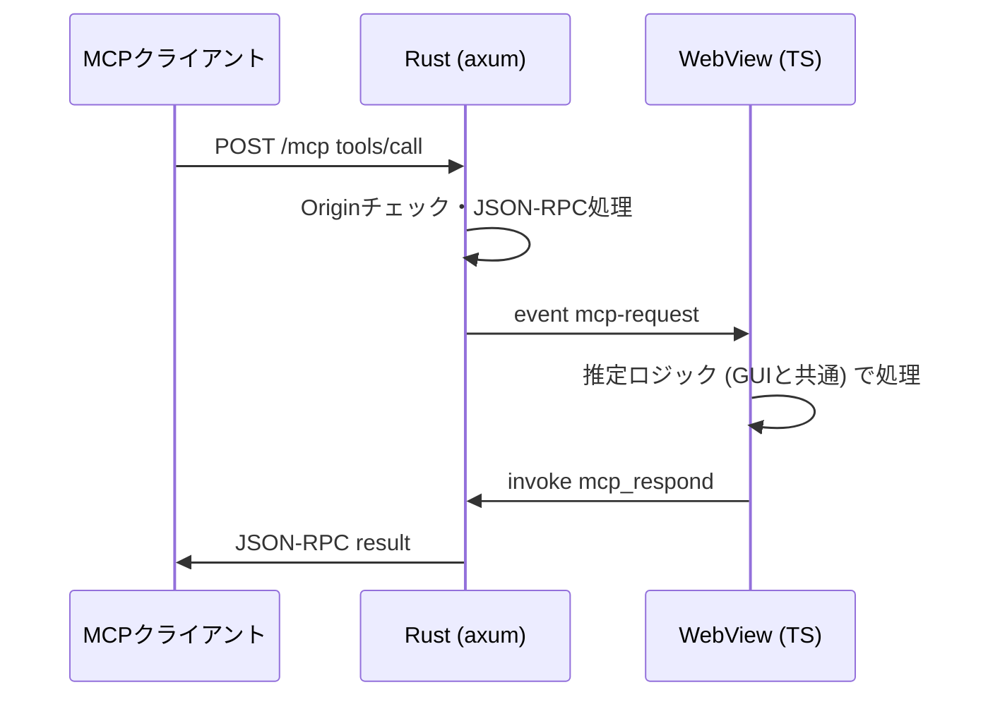
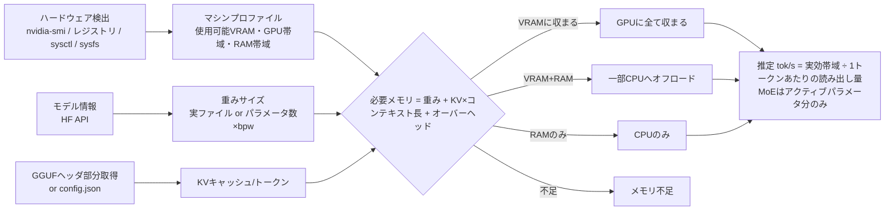
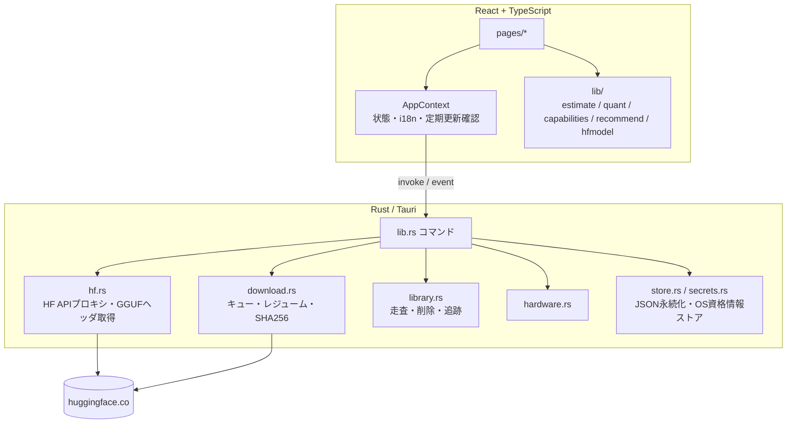

# LLM Model Searcher

LM Studio のモデル検索機能を切り出し、モデルの**検索・推奨・ダウンロード・追跡**に特化したデスクトップアプリです。
実行中のマシンのスペック (GPU / VRAM / RAM / メモリ帯域) を検出し、各モデル・各量子化がこのPCで動くか、どの程度の速度が出るかを推定します。

Tauri v2 (Rust) + React + TypeScript 製で、Windows / macOS / Linux に対応します。

## 主な機能

| 画面 | 内容 |
|---|---|
| 検索 | Hugging Face 全体を検索 (GGUF / MLX / safetensors)。並び順・タスク・サイズ・「このPCで動くもののみ」で絞り込み。モデルの特性をアイコン表示し、特性でも絞り込める |
| おすすめ | 用途別 (汎用チャット / コーディング / 推論 / 画像入力 / 日本語 / 埋め込み) に、このPCで快適に動くモデルと最適な量子化を提示 |
| トレンド・新着 | トレンド順・公開順・更新順の一覧を適合度付きで表示 |
| モデル詳細 | 量子化ごとの必要メモリ (重み + KVキャッシュ + その他)・適合度・推定 tok/s、おすすめの量子化、ダウンロード、README、量子化版・派生モデルの一覧 |
| ライブラリ | 保存済みモデルの一覧・容量・削除。公開からの経過期間、ファイル更新、`new_version`、後継モデル (推定)、保存後に公開された派生モデルを追跡 |
| ダウンロード | キュー、同時ダウンロード数の制御、一時停止・再開 (Range によるレジューム、再起動後も継続)、SHA256 検証 |
| お気に入り・履歴 | お気に入りモデルと検索条件の履歴 (再検索可) |
| システム | 検出したハードウェアと、推定に使う値 (使用可能VRAM・帯域) |
| 設定 | 保存先、言語 (日本語/英語)、テーマ、推定条件、ハードウェア値の上書き、Hugging Face トークン |

### モデルの特性アイコン

| 特性 | 判定方法 |
|---|---|
| 画像入力 | pipeline_tag (`image-text-to-text`)、タグ、GGUFアーキテクチャ名 (qwen3vl, gemma3, mistral3 等)、モデル名、mmproj ファイルの有無 (詳細画面) |
| ツール呼び出し | GGUF のチャットテンプレートに `tools` / `tool_call` を含むか、タグ |
| 推論・思考 | チャットテンプレートの `<think>` / `enable_thinking`、タグ、モデル名 |
| コーディング / 日本語 / 埋め込み / 音声入力 / 検閲解除版 | タグ・言語タグ・pipeline_tag・モデル名 |
| 多言語 | 英語以外の言語タグが5つ以上 |
| 長文脈 | 最大コンテキスト 128K 以上 |
| MoE | 名前の `A3B` 形式、アーキテクチャ、GGUF の expert 数 |

「LLM以外を除く」(既定で有効) は画像生成・音声合成などの pipeline_tag を持つモデルを一覧から除外します。

## インストール

[Releases](https://github.com/Echos/LLMModelSearcher/releases) から OS に合ったファイルをダウンロードします。

| OS | ファイル |
|---|---|
| Windows | `*_x64-setup.exe` (NSIS) または `*_x64_en-US.msi` |
| macOS (Apple Silicon) | `*_aarch64.dmg` |
| macOS (Intel) | `*_x64.dmg` |
| Linux | `*_amd64.AppImage` / `*_amd64.deb` / `*.x86_64.rpm` |

- 配布物はコード署名していません。Windows では SmartScreen の警告が出る場合があります (「詳細情報」→「実行」)。
- macOS では初回起動時にブロックされるため、アプリを右クリック →「開く」で起動するか、`xattr -dr com.apple.quarantine "/Applications/LLM Model Searcher.app"` を実行してください。

## MCPサーバー

Claude Code などの MCP クライアントから、このアプリの機能をツールとして呼び出せます。設定画面の「MCPサーバー」で有効にすると、アプリ起動中のみ `http://127.0.0.1:7865/mcp` (Streamable HTTP) で待ち受けます。

```bash
claude mcp add --transport http llm-model-searcher http://127.0.0.1:7865/mcp
```

stdio のみ対応のクライアント (Claude Desktop など) は `mcp-remote` 経由で接続します。

```json
{ "mcpServers": { "llm-model-searcher": { "command": "npx", "args": ["-y", "mcp-remote", "http://127.0.0.1:7865/mcp"] } } }
```

| ツール | 内容 |
|---|---|
| `get_hardware` | 検出したハードウェアと推定に使う値 |
| `search_models` | 検索 (形式・タスク・特性・サイズ・このPCで動くもののみ) と適合度・推定速度 |
| `get_model` | 量子化ごとのサイズ・必要メモリ・適合度・推定 tok/s・おすすめ・保存済みか |
| `recommend_models` | 用途別のおすすめ |
| `list_trending` | トレンド・新着・最近更新 |
| `get_readme` | モデルカード |
| `list_library` / `list_downloads` / `list_favorites` | ローカルの保存済みモデル・追跡結果、ダウンロード状況、お気に入り |
| `download_model` | ダウンロードの開始 (量子化を省略するとこのPC向けのおすすめ)。設定で無効化できる |

ファイルの削除や設定の変更は MCP からはできません。接続は 127.0.0.1 のみ受け付け、ブラウザからの他オリジンのリクエスト (DNSリバインディング) は Origin ヘッダで拒否します。



## 保存先の構成

設定で指定したディレクトリの下に、LM Studio と同じ構成で保存します。

```
<保存先>/<公開者>/<リポジトリ>/<ファイル>
例: D:\Models\unsloth\Qwen3-8B-GGUF\Qwen3-8B-Q4_K_M.gguf
```

ダウンロード中のファイルは `<ファイル>.part` として保存され、完了・検証後にリネームされます。

## 適合度・速度の推定方法



- **KVキャッシュ**: GGUF はファイル先頭のメタデータだけを Range リクエストで取得して層数・KVヘッド数から算出、safetensors / MLX は `config.json` から算出します。取得できない場合はパラメータ数から推定します。
- **GPU帯域**: GPU名から参考値の表 (`src/lib/bandwidth.ts`) を引きます。未知のGPUや実測と異なる場合は設定で上書きできます。
- **Apple Silicon**: 統合メモリのうち macOS が既定で GPU に割り当てる上限 (約 2/3〜3/4) を使用可能VRAMとします。MLX 形式は Apple Silicon でのみ「対応」になります。
- 推定値は目安です。実際の速度はランタイム・設定・プロンプト長により変わります。

## アーキテクチャ



アプリの状態はアプリデータディレクトリ (Windows: `%APPDATA%\com.echos.llmmodelsearcher`) に保存します。

| ファイル | 内容 |
|---|---|
| `state.json` | 設定・お気に入り・検索履歴 |
| `library.json` | ダウンロード記録 (リビジョン・LFSハッシュ) と追跡結果 |
| `downloads.json` | ダウンロードキュー (再起動後の再開用) |

Hugging Face トークンは OS の資格情報ストア (Windows 資格情報マネージャ / macOS キーチェーン / Linux Secret Service) に保存します。

## 開発

必要なもの: Node.js 20+、Rust (stable)、[Tauri の前提パッケージ](https://tauri.app/start/prerequisites/)

```bash
npm install
```

```bash
npm run tauri dev
```

```bash
npm run tauri build
```

テスト:

```bash
npm test
```

```bash
cd src-tauri && cargo test
```

Hugging Face に実際に接続する結合テスト (GGUFヘッダ取得・追跡) は `#[ignore]` 付きです。

```bash
cd src-tauri && cargo test -- --ignored
```

### リリース

1. `package.json` / `src-tauri/Cargo.toml` / `src-tauri/tauri.conf.json` のバージョンを更新する
2. 依存を変更した場合は第三者ライセンス告知を再生成する (`npm run licenses`)
3. `v<バージョン>` タグを push すると、GitHub Actions が Windows / macOS (arm64・x64) / Linux のパッケージをビルドし、下書きリリースに添付する

## ライセンス

[MIT](LICENSE)

配布物には依存ライブラリのライセンス告知 [THIRD_PARTY_LICENSES.md](THIRD_PARTY_LICENSES.md) を同梱しています。「LM Studio」「Hugging Face」は各社の商標であり、本プロジェクトはそれらと提携していません。
